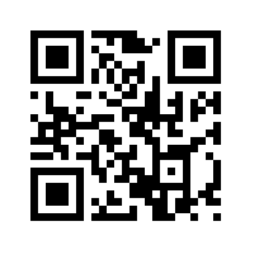

# TUV

Pure-Rust QR and Micro QR code encoder with SVG, PNG, and terminal output.

TUV, for QRs

## Install

```toml
cargo add tuv
```

## Usage

### High-level builder (primary API)

UTF-8 string (byte mode — not Kanji mode):

```rust
use tuv::{QRCode, Version, ECCLevel};

let qr = QRCode::from("https://example.com").generate()?;
```


Raw bytes (byte mode; any byte slice, including non-UTF-8):

```rust
let qr = QRCode::from_bytes(b"Hello").with_ecc(ECCLevel::L).generate()?;
```


Shift JIS Kanji mode (raw double-byte bytes, not UTF-8):

```rust
let qr = QRCode::from_bytes(b"\x82\xa0").with_ecc(ECCLevel::M).generate()?;
```


Normal or Micro QR version:

```rust
let qr = QRCode::from("123")
    .with_ecc(ECCLevel::L)
    .with_version(Version::Micro(1))
    .generate()?;
```


> **Note:** Micro QR requires a **Micro QR-capable** scanner. Standard QR apps (and iPhone Camera) often cannot read Micro QR.

Micro QR with auto-selected smallest version:

```rust
let qr = QRCode::from_bytes(b"123")
    .with_micro()
    .with_ecc(ECCLevel::L)
    .generate()?;
```


Backward-compatible render helpers:

```rust
let qr = QRCode::from("https://example.com").generate()?;
let svg = qr.to_svg(true);
let png = qr.to_png(300, true);
```


### Render builder

Custom colors (SVG or PNG):

```rust
let qr = QRCode::from("https://example.com").generate()?;

let svg = qr.render()
    .dark_color("#800000")
    .light_color("#ffff80")
    .min_dimensions(200, 200)
    .quiet_zone(true)
    .build_svg();
```


Terminal unicode blocks (text output; encoded symbol shown below). Default scale is 2 columns per module (~66 cols for a typical URL); use [`Renderer::unicode_scale`](https://docs.rs/tuv/latest/tuv/render/struct.Renderer.html#method.unicode_scale) for larger terminal output:

```rust
let terminal = qr.render().build_unicode();
let larger = qr.render().unicode_scale(3).build_unicode();
```


Luma image buffer:

```rust
let luma = qr.render().build_image_luma();
```


Transparent background (PNG alpha 0 / SVG without background rect):

```rust
let png = qr.render()
    .transparent_background(true)
    .min_dimensions(200, 200)
    .build_png();
let svg = qr.render()
    .transparent_background(true)
    .build_svg();
```


### Low-level Bits API

```rust
use tuv::bits::Bits;
use tuv::{QRCode, Version, ECCLevel};

let mut bits = Bits::new(Version::Normal(1));
bits.push_eci_designator(9)?;
bits.push_byte_data(b"\xa1\xa2\xa3")?;
bits.push_terminator(ECCLevel::L)?;
let qr = QRCode::from_bits(bits).with_ecc(ECCLevel::L).generate()?;
```


### Matrix introspection

After `generate()`, the resulting `QRCode` exposes the encoded module grid for inspection, tests, or custom renderers (separate from the PNG/SVG/unicode render helpers above).

```rust
use tuv::{Color, QRCode, Version, ECCLevel};

let qr = QRCode::from("Hi")
    .with_version(Version::Normal(1))
    .with_ecc(ECCLevel::L)
    .generate()?;

// (x, y) = column, row; (0, 0) is the top-left module.
// The grid is the symbol only (21×21 here)—quiet zone is added at render time.
let x = 10;
let y = 10;

let dark: bool = qr[(x, y)] == Color::Dark;    // Color::Dark or Color::Light at (x, y)
let max_err = qr.max_allowed_errors(); // max flipped modules Reed–Solomon can fix
let functional = qr.is_functional(x, y); // true for finder/timing/format modules, not data
let bits = qr.to_vec();                // flat Vec<bool>, row-major, dark = true
let colors = qr.to_colors();           // same layout as to_vec(), as Color values

// Debug dump only (tests, assert snapshots)—not for terminal display:
let dump = qr.to_debug_str('#', '.');
```


## Defaults

- When `with_ecc` is omitted, version and ECC are **co-optimized** for the smallest symbol (try each version from smallest upward, and at each version try ECC L → M → Q → H).
- When `with_version` is set but ECC is omitted, the **lowest** ECC level that fits at that version is chosen.
- When `with_ecc` is set but version is omitted, only version is auto-selected (unchanged).
- Call [`with_micro()`](https://docs.rs/tuv/latest/tuv/struct.QRCodeBuilder.html#method.with_micro) to search Micro QR versions (v1–4) instead of Normal QR (v1–40).
- [`QRCode::from`](https://docs.rs/tuv/latest/tuv/struct.QRCode.html#method.from) / UTF-8 strings use **byte mode**. True **Kanji mode** requires Shift JIS bytes via [`from_bytes`](https://docs.rs/tuv/latest/tuv/struct.QRCode.html#method.from_bytes) or [`Bits::push_kanji_data`](https://docs.rs/tuv/latest/tuv/bits/struct.Bits.html#method.push_kanji_data).
- Mask auto-selects the lowest-penalty pattern when `with_mask_id` is omitted.
- Micro QR uses a 2-module quiet zone; Normal QR uses 4.
- [`Renderer::transparent_background`](https://docs.rs/tuv/latest/tuv/render/struct.Renderer.html#method.transparent_background) (default `false`) makes PNG light modules and quiet zone fully transparent and omits the SVG background `<rect>`. [`to_png`](https://docs.rs/tuv/latest/tuv/struct.QRCode.html#method.to_png) / [`to_svg`](https://docs.rs/tuv/latest/tuv/struct.QRCode.html#method.to_svg) remain opaque unless you use the render builder.

## CLI

An optional command-line tool lives in `crates/tuv-cli`:

SVG output:

```bash
cargo run -p tuv-cli -- "Hello" -o hello.svg
```


PNG output:

```bash
cargo run -p tuv-cli -- "Hello" --png -o hello.png
```


Micro QR version 1:

```bash
cargo run -p tuv-cli -- "123" --micro 1 --ecc L -o micro.svg
```


Micro QR auto version:

```bash
cargo run -p tuv-cli -- "123" --micro --ecc L -o micro-auto.svg
```


Terminal unicode (text output; encoded symbol shown below). Default `--unicode-scale` is 2 (~66 cols for a typical URL); use 3–4 for easier phone scanning on wider terminals:

```bash
cargo run -p tuv-cli -- "Hello" --unicode
cargo run -p tuv-cli -- "https://example.com" --unicode --unicode-scale 3
```


Custom colors:

```bash
cargo run -p tuv-cli -- "Hello" --dark-color "#800000" --light-color "#ffff80" -o colored.svg
```


## Testing

Encoding and matrix behavior are verified by the crate's own test suite against the QR specification (no external encoder dependency).

## License

MIT

## Other


